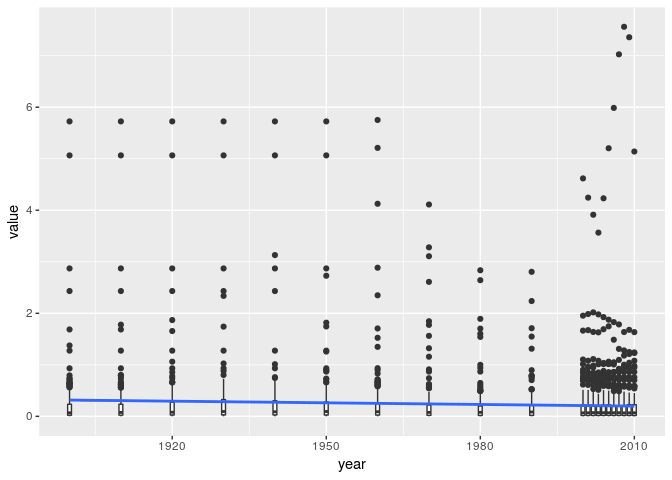
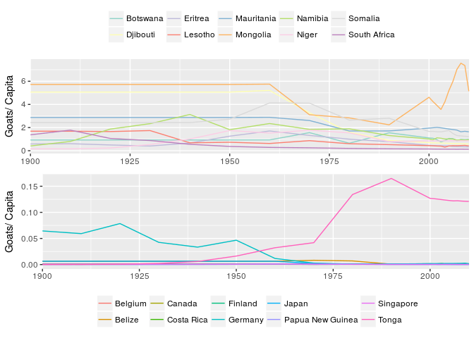

# goats_per_capita
Robert Schlegel  
10 July 2017  


## Objective
A few weeks ago for a [post](http://kelpsandthings.org/robert/r/gender-and-gdp/) about the relationship between gender equality and GDP/ capita I found a nifty [website](https://www.clio-infra.eu/) that has a massive amount of census information for most countries on our planet. Much of this information could be used to answer some very interesting and/ or important questions. But some of the data can be used to answer seemingly pointless questions. And that's what I intend to do this week. Specifically, which countries in the world have the highest rates of goats/ capita?

## Data
The goats per capita data were downloaded from the [clia-infra](https://www.clio-infra.eu/Indicators/GoatsperCapita.html) website. These data are already in the format we need so there is little to be done before jumping straight into the analysis. We will however remove any records from before 1900 as these are almost entirely estimates, and not real records.


```r
# Load libraries
library(tidyverse)
library(gridExtra)

# Load data
goats <- read_csv("../data/GoatsperCapita_Compact.csv") %>% 
  filter(year >= 1900)
```

## Analysis
First of all, I would like to know what the global trend in goats/ capita has been since 1900. To do so we need to create annual averages and apply a simple linear model to them. We will also plot boxplots to give us an idea of the spread of goats/ capita over the world.


```r
goats %>% 
  group_by(year) %>% 
  select(-ccode, -country.name) %>% 
  summarise(value = mean(value)) %>% 
  ggplot(aes(x = year, y = value)) +
  geom_boxplot(data = goats, aes(group = year)) +
  geom_smooth(method = "lm")
```

<!-- -->

**Figure 1**: Boxplots with a fitted linear model showing the global trend in goats/ capita over the last century.

As we may see in Figure 1, the overall trend in goats/ capita in the world has been decreasing very slightly over the last century. The striking result from Figure 1 however is the massive range of values as seen by the outliers from the boxplots. So which countries are these that have so many more goats/ capita than the rest of the world?

We want to see which countries have the most goats/ capita but there are 172 unique countries in this dataset so it would look much too busy to plot them all. To that end we want only the top and bottom 10 countries from the most recent year of reporting (2010).


```r
# Top 10 goat having countries
goats_top <- goats %>% 
  arrange(desc(value)) %>% 
  filter(ccode %in% head(unique(ccode), 10))

# Bottom 10
goats_bottom <- goats %>% 
  arrange(value) %>% 
  filter(ccode %in% head(unique(ccode), 10))

# Line graphs
gt <- ggplot(data = goats_top, aes(x = year, y = value)) +
  geom_line(aes(colour = country.name)) +
  labs(y = "Goats/ Capita", x = NULL) +
  scale_x_continuous(expand = c(0,0)) +
  scale_color_brewer(name = NULL, palette = "Set3") +
  theme(legend.position = "top")
gb <- ggplot(data = goats_bottom, aes(x = year, y = value)) +
  geom_line(aes(colour = country.name)) +
  labs(y = "Goats/ Capita", x = NULL) +
  scale_x_continuous(expand = c(0,0)) +
  theme(legend.position = "bottom",
        legend.title = element_blank())

# Combine
grid.arrange(gt, gb)
```

<!-- -->

**Figure 2**: Line graphs showing the rate of goats/ capita for the top and bottom 10 goat having countries in the world over the last century.

## Summary
I was a bit surprised to find that Mongolia is far and away the country with the most goats/ capita at 5.140 in 2010. Less surprising is that the other top 9 goat having countries in the world in 2010 were all in Africa and their rate of goats/ capita was between 1.634 (Mauritania) to 0.124 (South Africa). This makes for a massive spread in what is already an outlying set of countries. How is it that Mongolia has so many more goats/ capita? This is a very odd result but the data were reported annually from 2000 to 2010 and they consistently show similarly high rates for Mongolia.

The bottom 10 goat having countries in the world are a mix of European, Asian, North American and Pacific Islands. This mix is not surprising as we may see in Figure 1 that there are no outliers in the bottom of the distribution. The highest value for the bottom 10 countries in 2010 was Tonga at 0.121. This is very close to the lowest value from the top 10 countries, and shows us that most of the 172 countries in this dataset have ~0.12 goats per person. With this average in mind, we see that the other bottom nine countries in Figure 2 really are much lower than the global average with rates approaching 0 goats/ capita. It is worth mentioning that the lowest overall rate of goats/ capita in 2010 was Japan at 0.0001. Meaning that there is only one goat in Japan for every 10,000 people. As opposed to Mongolia that has more than five goats for every one person. Therefore there were 50,000 times more goats/ capita in Mongolia than Japan in 2010...

I supposes the take away message from this analysis is that if one ever wants to get away from it all and just go spend time with a lot of goats, [Mongolia](http://www.mfa.gov.mn/?lang=en) is the place for you! 

(and definitely avoid Japan)

