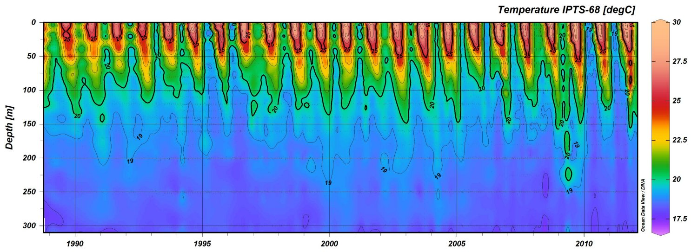

```{r, echo=FALSE}
knitr::opts_chunk$set(
  fig.path = '../figures/',
  cache = FALSE
)
```

## Objective
With more and more scientists moving to open source software (i.e. R or Python) to perform their numerical analyses the opportunities for collaboration increase and we may all benefit from this enhanced productivity. At the risk of sounding sycophantic, the future of scientific research truly is in multi-disciplinary work. What then could be inhibiting this slow march towards progress? As with most everything else in our lives that we persist in against our better judgment, the answer is that we tend to like to stick to waht is comfortable. Oceanographers in South Africa have been using [MATLAB](https://www.mathworks.com/products/matlab.html) and [ODV](http://odv.awi.de/) (Ocean Data View) since about the time that jesus was lacing up his sandles for his first trip to Palestine. There has been much debate on the future of MATLAB in science, so I won't get into that here, but I will say that the the package `oce` contains nearly all of the code that one would need for oceanographic work in R. The software that has however largely gone under the radar in the software debates has been ODV. Probably because it is free (after registration) it's fate has not been sealed by university departments looking to cut costs. The issue with ODV however is the same with all Microsoft products; the sin of having a "pointy clicky" user interface. One cannot perform truly reproducible research with a menu driven user interface. The steps must be written out in code. And so here I will lay out those necessary steps to create an interpolated CTD time series of temperature values that looks as close to the defalut output of ODV as possible.


angstroms v0.0.1: Provides helper functions for working with Regional Ocean Modeling System (ROMS) output.



**Figure 1**: The default output of ODV when plotting temperature by depth through time at one location.

## Colour Palette
Perhaps the most striking thing about the figures that ODV creates is it's colour palette. It is surprisingly  cheery for software designed in Germany. A large criticism of this colour palette is that the range of colours used are not equally wieghted visually, with the bright reds drawing ones eye more than the muted blues. This issue can be made up for using the `viridis` package, but for now we will stick to a ODV-like colour palette as that is part of our current objective.

```{r, warning=FALSE, message=FALSE}
# Load libraries
library(tidyverse)
library(lubridate)
library(reshape2)
library(colorRamps)
library(MBA)
library(mgcv)
library(FNN)

# Load and screen data
  # For ease I am only using monthly means
  # and depth values rounded to 0.1 metres
ctd <- read_csv("../data/ctd.csv") %>% 
  mutate(depth  = -depth) %>%  # Correct for plotting
  filter(site == 1) %>% 
  select(date, depth, temperature) %>% 
  rename(temp = temperature) %>%
### Comment out the following lines to keep the full resolution
  # mutate(date = round_date(date, unit = "month")) %>%
  mutate(depth = round(depth, 1)) %>%
  group_by(date, depth) %>%
  summarise(temp = round(mean(temp, na.rm = TRUE),1))
###

# Create quick scatterplot
ggplot(data = ctd, aes(x = date, y = depth)) +
  geom_point(aes(colour = temp)) +
  scale_colour_gradientn(colours = matlab.like2(10)) +
  labs(y = "depth (m)", x = NULL, colour = "temp. (°C)")
```

**Figure 2**: A non-interpolated scatterplot of our temperature (°C) data shown as a function of depth (m) over time.

## Interpolating
Figure 2 is a far cry from the final product we want, but it is a step in the correct direction. One of the things that sets ODV apart from other visualisation softwares is that it very nicely interpolates the data you give it. While this looks nice, there is some criticism that may be leveld against doing so. That being said, what we want is a pretty visualisation of our data. We are not going to be using these data for any numerical analyses so the main priority is that the output allows us to better visually interpret the data. The package `MBA` already has the necessary functionality to do this, and it works with `ggplot2`, so we will be using this to get our figure. The interpolation method used by `mba.surf()` is multilevel B-splines.

In order to do so we will need to `dcast()` our data into a wide format so that it simulates a surface layer. `spread()` from the `tidyr` package doesn't quite work as we want a proper surface map, which is outside of the current ideas on the structuring of tidy data. Therefore, after casting our data wide we will use `melt()`, rather than `gather()`, to get the data back into long format so that it works with `ggplot2`. 

It is important to note with the use of `mba.surf()` that it transposes the values while it is creating the calculations and so creating an eneven grid does not work well. With this method one needs to always give the same values for the amount of pixels on the x and y axes.

To create a colour palette that appears colser to the ODV standard I decided to use [GIMP](https://www.gimp.org/downloads/) to [extract](https://www.youtube.com/watch?v=VHyFgTZmnF8) the hexidecimal colour values from the colour bar in Figure 1.

```{r, warning=FALSE, message=FALSE}
# Manually extracted hexidecimal ODV colour palette
ODV_colours <- c("#feb483", "#d31f2a", "#ffc000", "#27ab19", "#0db5e6", "#7139fe", "#d16cfa")

# The date column must then be converted to numeric values
ctd$date <- decimal_date(ctd$date)

# Now we may interpolate the data
ctd_mba <- mba.surf(ctd, no.X = 300, no.Y = 300, extend = T)
dimnames(ctd_mba$xyz.est$z) <- list(ctd_mba$xyz.est$x, ctd_mba$xyz.est$y)
ctd_mba <- melt(ctd_mba$xyz.est$z, varnames = c('date', 'depth'), value.name = 'temp') %>% 
  filter(depth < 0) %>% 
  mutate(temp = round(temp, 1))

# Finally we create our gridded result
ggplot(data = ctd_mba, aes(x = date, y = depth)) +
  geom_raster(aes(fill = temp)) +
  scale_fill_gradientn(colours = rev(ODV_colours)) +
  geom_contour(aes(z = temp), binwidth = 2, colour = "black", alpha = 0.2) +
  geom_contour(aes(z = temp), breaks = 20, colour = "black") +
### Activate to see which pixels are real and not interpolated
  # geom_point(data = ctd, aes(x = date, y = depth),
  #            colour = 'black', size = 0.2, alpha = 0.4, shape = 8) +
###
  labs(y = "depth (m)", x = NULL, fill = "temp. (°C)") +
  coord_cartesian(expand = 0)
```

**Figure 3**: The same temperature profiles seen in Figure 2 with the missing values filled in with multilevel B-splines. Note the artefact crreated in the bottom right corner.

At first glance this now appears to be a very good aproximation of the output from ODV. An astute eye will have noticed that the temperatures along the bottom right corner of this figure are not interpolatingin a way that appears possible. It is very unlikely that there would be a deep mixed layer underneath the thermoclines detected during 2015. The reason the splines create this artefact is that they are based on a convex hull around the real data points and so the interpolating algorithm wants to perfrom a regression towards a mean value away from the central point of where the spline is being calculated from. Because the thermoclines detected are interspersed between times where the entire water column consists of a mixed layer `mba.surf()` is filling in the areas without data as though they should are a fully mixed surface layer.

There are many ways to deal with this problem with three possible fixes coming to mind quickly. The first is to set `extend = F` within `mba.surf()`. This tells the algorithm not to fill up every part of the plotting area and will alleviate some of the inaccurate interpolation that occurs but will not eliminate it. The second fix, which wouldprevent all innacurate interpolation would be to limit the depth of all of the temperature profiles to be the same as the shollowest sampled profile. This is not an ideal fix because we would then lose quite a bit of information from the deeper sampling that occurred from 2013 to 2014. The third fix is the best but most dramatic departure from the methods we have used thus far. In order to interpolate across all of our data, but not create artefacts we will need to create a bounding box and use soap-film smoothing. The benefit of soap-film smoothing over some other method, such as a normal GAM, is that it more accurately acknowledges the bounding box we supply it. This means that if there are large differences in the depths of samplings the soap-film will not interpolate across that gap. Thus preventing the undue exapnsion of the mixed-layer artefact.

```{r}
# First create a bounding box
  # These are meant to be pulled from shape files
  # So we need to be a bit sneeky about how we make this
  # Also, because we are using our data as a bounding box
  # we want to slightly extend the edges so as to use all of our ata
left <- ctd[ctd$date == min(ctd$date),] %>% 
  select(-temp) %>% 
  ungroup() %>% 
  mutate(date = date-0.01)
bottom <- ctd %>%
  group_by(date) %>% 
  summarise(depth = min(depth)) %>% 
  mutate(depth = depth-0.01)
right <- ctd[ctd$date == max(ctd$date),] %>% 
  select(-temp) %>% 
  ungroup() %>% 
  mutate(date = date+0.01)
top <- ctd %>%
  group_by(date) %>% 
  summarise(depth = max(depth)) %>% 
  mutate(depth = depth+0.01)
bounding_box <- rbind(data.frame(left[order(nrow(left):1),]), data.frame(bottom), 
                      data.frame(right), data.frame(top[order(nrow(top):1),]))

# Now that we have a bounding box we need to 
# create knots for the soap-film smoothing

# Now we get to the soap-filter
bounding_box_list <- list(bounding_box)

ctd_mba_bound <- ctd_mba[inSide(bounding_box_list, date, depth),]

fsb <- list(bounding_box)
names(fsb[[1]]) <- c("v","w")
nmax <- 100
## create some internal knots...
knots <- data.frame(v=rep(seq(2013,2016,length.out=10),6),
                    w=rep(c(-2, -7, -12, -17, -22, -27), 10))
# Remove knots that lay outside of the bounding box
v <- knots$v
w <- knots$w
knots <- knots[inSide(fsb, x=v, y=w),]
# Test plot
ggplot(data = knots, aes(x = v, y = w)) +
  geom_path(data = bounding_box, aes(x = date, y = depth)) +
  geom_point(colour = "red")

## Simulate some fitting data, inside boundary...
set.seed(0)
n <- 600
v <- ctd$date
w <- ctd$depth
y <- ctd$temp
ind <- inSide(fsb,x=v,y=w) ## remove outsiders
# y <- y + rnorm(n)*.3 ## add noise
y <- y[ind];v <- v[ind]; w <- w[ind] 
n <- length(y)

tprs <- gam(temp ~ s(date, depth, k = 60), data = ctd, method = "REML", xt=list(bnd=fsb,nmax=nmax))
grid.x <- with(tprs$var.summary,
               seq(min(c(bounding_box[,1])), max(c(bounding_box[,1])), by = 0.1))
grid.y <- with(tprs$var.summary,
               seq(min(c(bounding_box[,2])), max(c(bounding_box[,2])), by = 0.1))
pdata <- with(tprs$var.summary, expand.grid(date = grid.x, depth = grid.y))
pdata <- transform(pdata, temp = predict(tprs, pdata, type = "response"))
inlake <- with(pdata, inSide(bounding_box_list, date, depth))
pdata <- pdata[inlake, ]

ggplot(bounding_box, aes(x = date, y = depth)) +
  geom_raster(data = pdata, aes(x = date, y = depth, fill = temp)) +
  geom_path() +
  # geom_point(data = knots, aes(x = lon, y = lat), size = 0.5) +
  geom_point(size = 0.1) +
  scale_fill_gradientn(colours = rev(ODV_colours))


## plot boundary with knot and data locations
plot(fsb[[1]]$v,fsb[[1]]$w,type="l");points(knots,pch=20,col=2)
points(v,w,pch=".")

nmax <- 100 ## reduced from default for speed.
tprs <- gam(y~s(v,w,k=30,bs="so",xt=list(bnd=fsb,nmax=nmax)),
            knots=knots[c(22:23),])
grid.x <- with(tprs$var.summary,
               seq(min(c(bounding_box[,1])), max(c(bounding_box[,1])), by = 0.1))
grid.y <- with(tprs$var.summary,
               seq(min(c(bounding_box[,2])), max(c(bounding_box[,2])), by = 0.1))
pdata <- with(tprs$var.summary, expand.grid(v = grid.x, w = grid.y))
# names(pdata) <- c("lon","lat")
##predictions
pdata <- transform(pdata, temp = predict(tprs, pdata, type = "response"))


inlake <- with(pdata, inSide(fsb, v, w))
pdata <- pdata[inlake, ]


ggplot(bounding_box, aes(x = date, y = depth)) +
  geom_raster(data = pdata, aes(x = v, y = w, fill = temp)) +
  geom_path() +
  # geom_point(data = knots, aes(x = lon, y = lat), size = 0.5) +
  geom_point(size = 0.1) +
  scale_fill_gradientn(colours = rev(ODV_colours))
  # coord_fixed() + ylab("Northing") + xlab("Easting") #+
  # scale_fill_viridis(na.value = NA)


```

