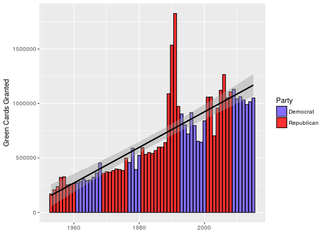
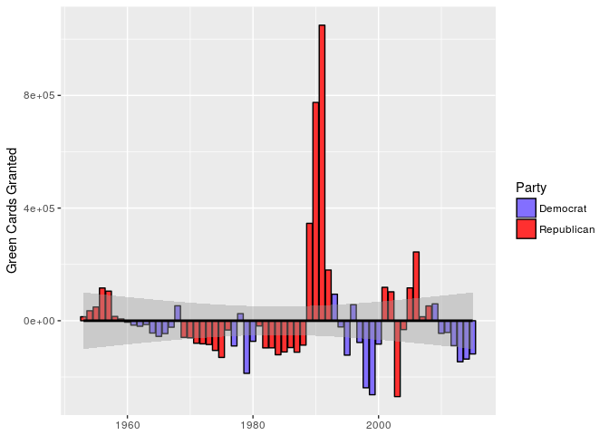

# party_immigration
Robert Schlegel  
3 July 2017  


## Objective
As an immigrant myself, all of the talk of immigration to be found in main stream media outlets today makes me a bit nervous. Whereas most people that speak of the pro's and con's of immigration do so from the point of view of how it may affect the country of their birth, I view this issue as something that affects my ability to live outside the country of my birth. I immigrated into the Republic of South Africa in 2013 and have been living here since. I would do a piece on South African immigration but the numbers are difficult to get a hold of and honestly most people are less interest in South Africa than the USA. 

Immigration is not a new talking point. It's something that comes up in political and a-political circles all of the time. The current debate on the Muslim Ban in the USA may have reached a new level for this sort of rhetoric in the West, but targeted crackdowns of this sort are not new in the world. I won't bother with citations here, but if one is interested a quick google of "xenophobia" + "border control" should yield some convincing results. As this current row of immigration debates in the USA has become so partisan, I decided that an interesting question to ask would be "Under which of the two parties have more people immigrated into the USA?" and "Under which of the two parties have more people been removed from the USA?"

## Data
The historical data on immigration into the USA are located at the [Department of Homeland Securities](https://www.dhs.gov/immigration-statistics/yearbook/2015) website. In 2013 the DHS started keeping very detailed reports of all immigration by age, country, marital status, etc. These highly detailed data are very interesting but will not help us to ask our central questions. We want long time series of data so that we may compare many different administrations from each party. For ease of analysis I have chosen to classify the party in power at any point in time based on the party of the President. I understand that the Senate or Congress would perhaps be better, if not more egalitarian choices, but the current focus of this issue has the US President at it's core, so I decided to keep that theme constant in this analysis. I'll only start from Eisenhower and go up until Obama as the publicly available DHS data end in 2015. They begin as far back as 1892, but `ggplot2` has built into it a US president dataframe and I am going to just use that because I'm lazy.


```r
# Libraries
library(tidyverse)
library(lubridate)
library(broom)
library(gridExtra)

# President data
data(presidential)
presidential$start <- year(presidential$start)
presidential$end <- year(presidential$end)-1

# Create index of party years
  # I couldn't think of a clever automatic way of doing this...
party_year <- data.frame(Year = seq(1953, 2016), Party = c(rep("Republican",8), rep("Democrat",8), 
                                                           rep("Republican",8), rep("Democrat",4),
                                                           rep("Republican",12), rep("Democrat",8),
                                                           rep("Republican",8), rep("Democrat",8)))

# Immigration data
green_card <- read_csv("../data/Persons Obtaining Lawful Permanent Resident Status-Fiscal Years 1820 to 2015.csv")
green_card <- merge(green_card, party_year, by = "Year")
removals <- read_csv("../data/Aliens Removed Or Returned-Fiscal Years 1892 To 2015.csv")
removals <- merge(removals, party_year, by = "Year")
```

## Immigration
In this first figure we are defining immigration as the number of people actually receiving a green card in any given year. This is the most strict definition of "immigration" and I think may be best used to show whom the USA was choosing to let in.


```r
ggplot(data = green_card, aes(x = Year, y = Number)) +
  geom_col(aes(fill = Party), colour = "black") +
  geom_smooth(method = "lm", colour = "black") +
  labs(x = NULL, y = "Green Cards Granted") +
  scale_fill_manual(values = c("slateblue1", "firebrick1"))
```

<!-- -->

**Figure 1**: Bar charts showing the number of green cards granted each year in the USA. The colour of the bars show the ruling party at the time of issuance. A linear model is imposed in black.


We may see in Figure 1 that the all time high for the granting of green cards was during the four year administration of George Bush Senior. These values are so much higher than the other administrations that it leverages the linear model drawn on these data up past where it should normally be to show the more normal trend exhibited by all of the other administrations since Eisenhower. That being said, we actually see a bit of a turn down during the Obama administration, with the largest year of green card issuance during the George Bush Junior administration larger than any year under Obama. I find that surprising. Figure 1 also shows us that we can't really directly compare the different administrations because as populations increase, so too will the number of people that want to immigrate. In a quick pinch however we may use the residuals from the linear model to give us a slightly better visualisation of how the parties stack up against one another.


```r
# Calculate residuals
green_card_resids <- augment(lm(Number~Year, data = green_card))
green_card_resids <- merge(green_card_resids, party_year, by = "Year")

# Plot them
ggplot(data = green_card_resids, aes(x = Year, y = .resid)) +
  geom_col(aes(fill = Party), colour = "black") +
  geom_smooth(method = "lm", colour = "black") +
  labs(x = NULL, y = "Green Cards Granted") +
  scale_fill_manual(values = c("slateblue1", "firebrick1"))
```

<!-- -->

**Figure 2**: The residuals from a linear model fitted to the data shown in Figure 1.

It appears as though whenever there was a Bush in office it was much easier to get a green card. And that Democrats generally made it more difficult to do so.

## Expulsion
Now that we have seen that it is easier to enter the USA during a Republican presidency, let's see under which party an illegal immigrant is most likely to be expelled. There are two different classes of expulsion: 'Removal' and 'Return'. Removal means that a legal order was issued to remove the individual. Return means that the individual was likewise not legally in the states, but left of their own volition.


```r
# Returns
return_bar <- ggplot(data = removals, aes(x = Year, y = Returns)) +
  geom_col(aes(fill = Party), colour = "black") +
  # geom_smooth(method = "lm", colour = "black") +
  labs(x = NULL, y = "Immigrants Returned") +
  scale_fill_manual(values = c("slateblue1", "firebrick1")) +
  ggtitle("Returns")

# Removals
removal_bar <- ggplot(data = removals, aes(x = Year, y = Removals)) +
  geom_col(aes(fill = Party), colour = "black") +
  # geom_smooth(method = "lm", colour = "black") +
  labs(x = NULL, y = "Immigrants Removed") +
  scale_fill_manual(values = c("slateblue1", "firebrick1")) +
  ggtitle("Removals")

# Stick'em
grid.arrange(return_bar, removal_bar)
```

<!-- -->

**Figure 3**: Two bar charts showing the rates of returns and  removals for immigrants from the USA.

Figure 3 tells a very interesting story. In the top panel (Returns), we see that from 1953-55 (shortly after WWII) there were massive numbers of immigrants that returned to their home countries voluntarily. Then there is a period of increase leading up to the 80's. This then follows a somewhat normal distribution, peaking in the late 90's near the end of the Clinton administration before the peaceful return of immigrants drops steadily through the 8 years of Bush then Obama. The bottom panel (Removals) shows the reason for this apparent relaxation on immigrants. It isn't that immigrants were being sent away less, but rather they began to be removed more forcefully than appears to have been the policy until something changed during the Clinton Administration. The rate of immigrants being removed became greater than those being returned in 2011 under Obama. Again we see a heavy hand on immigration during years with a Democratic president in office. It is hard to compare the parties on this issue as the policy of forcefully removing immigrants in favour of having them leave peacefully has only been in practice over three administrations (Clinton, Bush Jr. and Obama). That being said, it is worth noting that the y axes on these two figures are not the same. The increase in removals does not outweigh the decrease in returns. Overall the rate of expulsion of immigrants from the states declined during the Obama administration. And perhaps also Bush Jr.

It is fair criticism to point out that a green card may take several years to acquire. This means that when one begins the process of applying for a green card it may take so long that a different party will be in power by the time it is granted... or not. I would argue however that most of these parties (with the exception of Carter) are in office for eight year stretches. This is not meant to be a definitive analysis, but I think it has proven to be a rather interesting first step. I didn't expect the data to look like this. George Bush Senior, saviour to immigrants, who would have thought.
