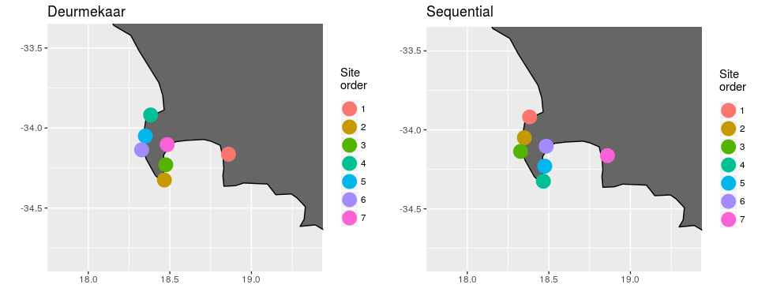
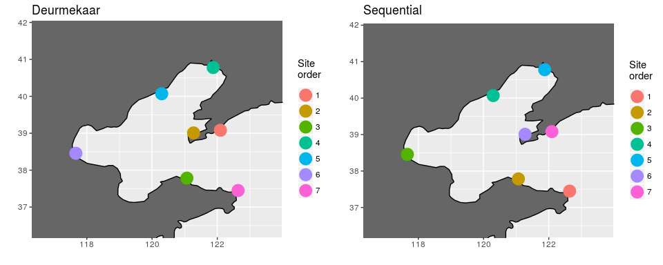

# seq_sites
Robert Schlegel  
23 August 2017  


```r
# devtools::install_github("robwschlegel/coastR") # Install coastR
library(coastR)
library(dplyr)
library(ggplot2)
library(gridExtra)
```

## Preface
The rest of the blog post after this preface section is a copy of the vignette I've written for the first function in the new package I am developing: `coastR`. This package aims to provide functions that are useful for coastal oceanography but that do not yet exist in the R language. It is not my intention to provide algorithms for physical oceanography as these may already be found elsewhere. This post covers how one may determine the correct sequence of sites along a convoluted coastline.

Now that I've handed in my PhD I am a little less pressed as far as deadlines go and I would like to return to my habit of creating a new blog post every Friday. I've written quite a bit of code over the last three years and much of it needs to find it's way into the `coastR`. Next week I am planning on uploading a function for calculating shore normal transects. Until then, please enjoy the spectacle of sequential ordering. Woo.


## Overview
The human mind prefers to see patterns in whatever it encounters. To this end we try to provide ourselves with data that are stored in a way that will appeal to that disposition. For a time series this usually means that the data are saved sequentially through time. For spatial data this means that the data are saved in some sort of sequential state, too. But what might that be? For 2D, 3D, or 4D data this can get tricky rather quickly and one tends to default to netcdf files. But with 1D data we are able to decide how we want the data to be structured as they will fit within a simple dataframe. But how can spatial data be 1D? Nothing in nature truly is, but I use 1D here as an expedient way of describing data that are constrained to some physical (usually continuous) barrier. Specifically for use with `seq_sites()` we will be looking at sites along a coastline. 

If one has meta-data for a number of sampling sites they should be saved in the order they may be found along the coastline. Some would perhaps prefer to order sites alphabetically, I am not one of them for a number of reasons. Not least of which being that this is too simple a way of organising. One could also choose to organise ones coastal sites in numerical order of either longitude or latitude. This quickly becomes problematic for most stretches of coastline as natural formations such as peninsulas and embayments will prevent the correct ordering of sites based on only latitude or longitude. It is therefore necessary to query the longitude and latitude of each site in a list against a land mask in order to determine the correct order along the coastline. This is what will be demonstrated below.


## Sample locations
For the purpose of this vignette we will manually create a few dataframes for different coastlines around the world of varying degrees of complexity and length. The first two dataframes are taken from the SACTN site list included in the `coastR` package. The rest have their lon/lat values grabbed from Google maps. Note that the order of the sites is intentionally entered incorrectly so as to be able to demonstrate the efficacy of `seq_sites()`.


```r
# Cape Point, South Africa
cape_point <- SACTN_site_list %>% 
  slice(c(31, 22, 26, 17, 19, 21, 30)) %>% 
  mutate(order = 1:n())

# South Africa
south_africa <- SACTN_site_list %>% 
  slice(c(1,34, 10, 20, 50, 130, 90)) %>% 
  mutate(order = 1:n())

# Baja Peninsula, Mexico
baja_pen <- data.frame(
  order = 1:7,
  lon = c(-116.4435, -114.6800, -109.6574, -111.9503, -112.2537, -113.7918, -114.1881),
  lat = c(30.9639, 30.7431, 22.9685, 26.9003, 25.0391, 29.4619, 28.0929)
)

# Bohai Sea, China
bohai_sea <- data.frame(
  order = 1:7,
  lon = c(122.0963, 121.2723, 121.0687, 121.8742, 120.2962, 117.6650, 122.6380),
  lat = c(39.0807, 39.0086, 37.7842, 40.7793, 40.0691, 38.4572, 37.4494)
)
```


## Sequential sites
Now that we have our sample sites it is time to order them correctly along the coast sequentially. Should one prefer the opposite order to what `seq_sites()` produces, this may be changed by using the `reverse` argument found within the function. Additionally, if one has sites located on islands just off the coast, one may choose to allow the algorithm to take these islands into account. Note that this then will force the algorithm to calculate the sequential order of these sites as though they were part of a different sequence because they will no longer be on the same 1D plain. Generally this would not be desirable and one would rather order sites on coastal islands in line with the rest of the coast. This is the default setting, but we may see how this changes with the Baja Peninsula site list.


```r
# NB: This code will produce warnings
  # This is fine as it is stating that the
  # 'order' column has been re-written,
  # which is the intended result of this function.

# Cape Point, South Africa
cape_point_seq <- seq_sites(cape_point)

# South Africa
south_africa_seq <- seq_sites(south_africa)

# Baja Peninsula, Mexico
baja_pen_seq <- seq_sites(baja_pen)
baja_pen_island_seq <- seq_sites(baja_pen, coast = FALSE)

# Bohai sea, China
bohai_sea_seq <- seq_sites(bohai_sea)
```


## Comparison
With the sites correctly ordered sequentially along the coast we may now compare the before and after products. To do so in a tidy way we will first create a function that plots our sites for us on a global map.


```r
# Create base map
world_map <- ggplot() + 
  borders(fill = "grey40", colour = "black")

# Create titles
titles <- c("Deurmekaar", "Sequential", "Islands")

# Plotting function
plot_sites <- function(site_list, buffer, title_choice){
  world_map +
  geom_point(data = site_list, size = 6,
             aes(x = lon, y = lat, colour = as.factor(order))) +
  coord_cartesian(xlim = c(min(site_list$lon - buffer), 
                           max(site_list$lon + buffer)),
                  ylim = c(min(site_list$lat - buffer), 
                           max(site_list$lat + buffer))) +
  labs(x = "", y = "", colour = "Site\norder") +
  ggtitle(titles[title_choice])
}
```


### Cape Point, South Africa

```r
cape_point_map <- plot_sites(cape_point, 0.5, 1)
cape_point_seq_map <- plot_sites(cape_point_seq, 0.5, 2)
grid.arrange(cape_point_map, cape_point_seq_map, nrow = 1)
```

<!-- -->
**Figure 1**: Comparison of ordering of sites around Cape Point, South Africa.


### South Africa

```r
south_africa_map <- plot_sites(south_africa, 1, 1)
south_africa_seq_map <- plot_sites(south_africa_seq, 1, 2)
grid.arrange(south_africa_map, south_africa_seq_map, nrow = 1)
```

<!-- -->
**Figure 2**: Comparison of ordering of sites around South Africa.


### Baja Peninsula, Mexico
Note in the image below that site seven in the 'Islands' panel appears to be ordered incorrectly. This is because we have asked the function to first look for sites along the coast, and then order sites around nearby islands by setting the argument `coast` to TRUE. This is because the algorithm only works on one continuous line. When islands are introduced this then represents a second set of 1D coordinates and so the algorithm plans accordingly. This feature has been added so that if one chooses to have islands be apart from the initial ordering of the coastal sites it may be done. The default however is to remove islands from the coastal land mask so that they are ordered according to their nearest location to the coast.


```r
baja_pen_map <- plot_sites(baja_pen, 1, 1)
baja_pen_seq_map <- plot_sites(baja_pen_seq, 1, 2)
baja_pen_island_seq_map <- plot_sites(baja_pen_island_seq, 1, 3)
grid.arrange(baja_pen_map, baja_pen_seq_map, baja_pen_island_seq_map, nrow = 1)
```

<!-- -->
**Figure 3**: Comparison of ordering of sites around the Baha Peninsula, Mexico.


### Bohai Sea, China
Below in the 'Sequential' panel we see the result of having set the `reverse` argument to TRUE. Hardly noticeable, but potentially useful.


```r
bohai_sea_map <- plot_sites(bohai_sea, 1, 1)
bohai_sea_seq_map <- plot_sites(bohai_sea_seq, 1, 2)
grid.arrange(bohai_sea_map, bohai_sea_seq_map, nrow = 1)
```

<!-- -->
**Figure 4**: Comparison of ordering of sites around the Bohai Sea, China.


## Conclusion
The usefulness of the `seq_sites()` function is demonstrated above on a number of different scales and coastal features. This is in no way an exhaustive test of this function and I welcome any input from anyone that uses it for their own work. The premise on which this function operates is very basic and so theoretically it should be very adaptive. The only thing to look out for is if one has a very convoluted coastline with a long stretch without any sites the algorithm may think this is two separate coastlines.
